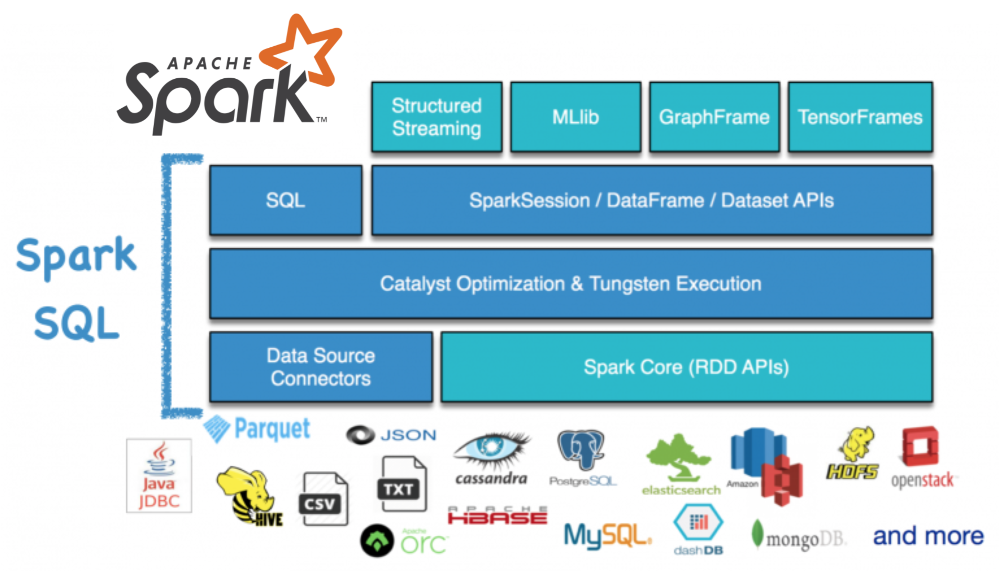

# Introduction

SQL Engine，参考主流开源分布式SQL引擎项目，主要基于Spark SQL 2.3.x进行整理和说明，以下列出主流开源分布式SQL引擎：

* [Spark SQL](https://spark.apache.org/sql/): Spark SQL is Apache Spark's module for working with structured data.
* [Hive](https://cwiki.apache.org/confluence/display/Hive): The Apache Hive ™ data warehouse software facilitates reading, writing, and managing large datasets residing in distributed storage using SQL. Structure can be projected onto data already in storage. A command line tool and JDBC driver are provided to connect users to Hive.
* [Presto](https://prestodb.io/docs/current/): Distributed SQL Query Engine for Big Data.

## Others:

* Impala
* Druid
* Kylin
* HAWQ
* Drill
* TiDB
* ClickHouse
* Doris(Palo)

