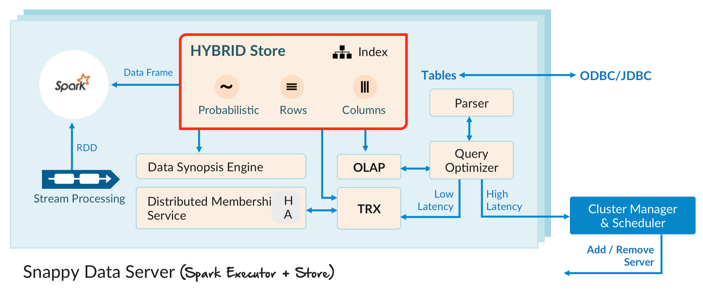

# Overview

## Key Features

- 100% compatible with Spar：与Spark完全兼容
- In-memory row and column stores：基于内存的行式和列式存储
- SQL standard compliance：支持标准SQL和丰富的扩展
- SQL based extensions for streaming processing：基于SQL流处理的扩展
- Not-Only SQL：可以作为数据库
- Mutate, transact on data in Spark：支持事务操作
- Optimizations - Indexing：支持索引
- Optimizations - colocation：数据本性化
- High availability not just Fault tolerance：数据容错，保持应用计算连续性
- Durability and recovery：表可以持久化到磁盘，在启动时候恢复
- Interactive analytics using Synopsis Data Engine (SDE): 概要数据引擎

## Paper

- SnappyData: A Unified Cluster for Streaming, Transactions, and Interactive Analytics

    [PDF](http://cidrdb.org/cidr2017/papers/p28-mozafari-cidr17.pdf)、[Slide](http://cidrdb.org/cidr2017/slides/p28-mozafari-cidr17-slides.pdf)

## Reference

- [Docs](http://snappydatainc.github.io/snappydata/)
- [Github](https://github.com/SnappyDataInc/snappydata)
- [SnappyData中文博客](https://snappydata-cn.github.io)